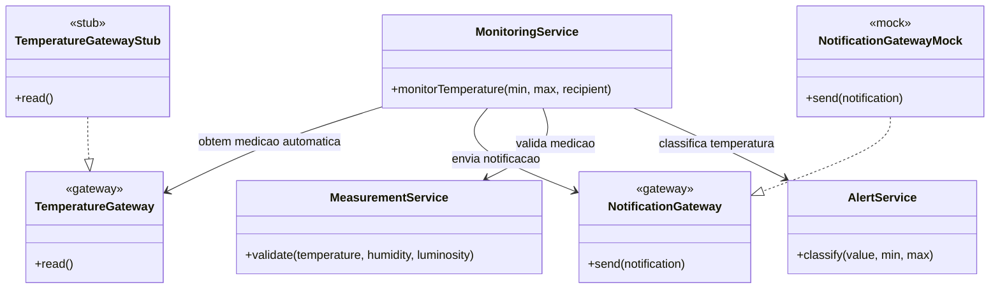

# Sprint 6 - Diagrama de Classes Global

O diagrama abaixo representa a solucao adotada no Sprint 6 para isolamento das dependencias externas com duplos de teste.

## Resumo para o relatorio

- O gateway de temperatura foi substituido por um `stub`, porque a leitura automatica precisa apenas de devolver valores controlados para exercitar os cenarios de negocio.
- O gateway de notificacoes foi substituido por um `mock`, porque o objetivo do teste e confirmar a interacao e garantir que a logica de envio e realmente executada quando existe alerta.
